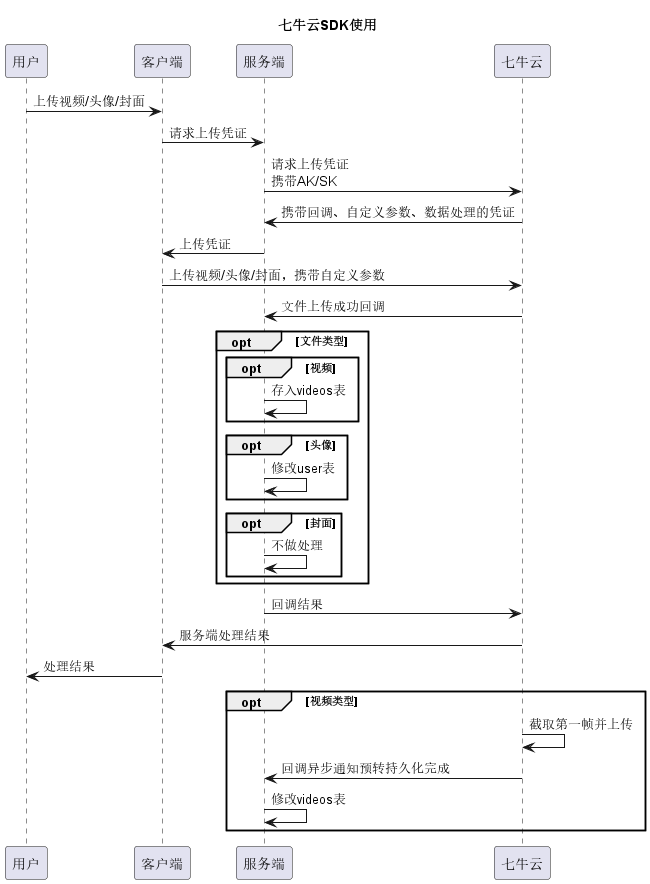
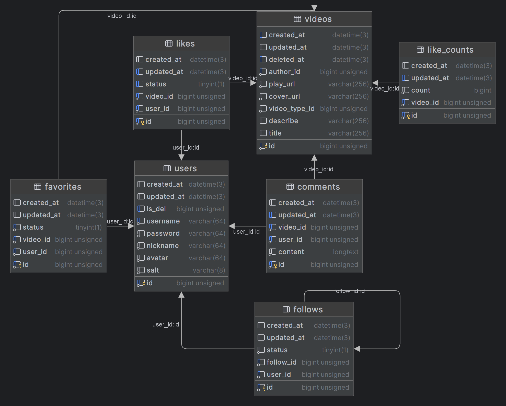

# 项目介绍

## 运行项目

### 使用说明

确保go版本大于等于1.21，通过`go version`命令检查

```shell
# 克隆项目
git clone git@github.com:VideoUtopia/utopia-back.git
cd utopia-back

# 修改配置文件，各字段含义见yaml文件字段备注
cp config/comfig_example.yaml config/congfig.yaml 
vim config/congfig.yaml

# linux 编译运行
go build -o server main.go 
./server

# windows
go build -o server.exe main.go
./server.exe
```

### 持续部署

本项目通过 Webhook + hookdoo + 自定义脚本进行持续部署，在 hookdoo 创建 Service、Hook，并将 url 配置到 Github 上

当提交代码时，Github 将向所配置的 URL 发送 POST 请求，hookdoo 检测到请求后执行我们配置的 shell 脚本

脚本配置如下：

```shell
#!/bin/bash

# 检查8080端口的占用情况
port=8080
pid=$(lsof -t -i:$port)

if [ -z "$pid" ]; then
  echo "端口 $port 没有被占用。"
else
  echo "端口 $port 被进程 $pid 占用。"

  # 终止占用8080端口的进程
  echo "终止进程 $pid ..."
  kill $pid

fi

echo "开始启动Go程序..."
nohup /usr/local/go/bin/go run main.go > output.log 2>&1 &
sleep 2 # 等待一段时间以确保程序已经启动
pid=$!
if [ -n "$(ps -p $pid -o pid=)" ]; then
  echo "Go程序已成功启动。"
else
  echo "Go程序启动失败，请检查错误信息。"
  exit 1
fi

# 检查Go程序的执行结果
if [ $? -eq 0 ]; then
  echo "Go程序执行成功。"
else
  echo "Go程序执行失败。"
  exit 1
fi
```

## 功能模块

### 中间件使用

+ 限频中间件：采用令牌桶对可针对不同接口配置不同的限流策略，同时支持对用户IP限流，防止用户恶意攻击，详见：[接口及IP限流](./接口及IP限流.md)
+ 日志中间件：使用 Zap 重写 Gorm 和 Gin 日志，提供更好的日志输出控制和格式化选项，以及更好的日志级别管理和错误追踪能力
+ 参数校验：通过 validator 库对参数进行校验，提高前后端双方开发效率，同时阻止用户不合理请求
+ 鉴权模块：通过 JWT 进行用户鉴权，保证Token不可被伪造，提升系统安全性

### 存储模块



1. 服务端下发凭证，保证密钥的安全性
2. 客户端上传 视频/头像/封面 均使用一个凭证，简化客户端开发
3. 针对未上传封面的视频，异步截取视频首帧，回调替换视频封面

参考七牛云文档设置自定义参数、预转持久化参数，并配置回调接口，详见文档：[七牛云SDK使用](./七牛云SDK使用.md)

### 视频模块

视频模块包含如下功能：

1. 获取某类内容视频  - 获取体育/游戏/动漫等某一类别的视频
2. 获取推荐视频     - 优先拉取关注用户发布的视频，按照发布时间排序，无视频后拉取热门视频
3. 获取热门视频     - 返回三小时内点赞量最多的视频
4. 搜索视频        - 根据标题匹配视频
5. 发布视频列表     - 获取该用户发布的视频
6. 视频收藏列表     - 获取该用户收藏的视频

上述所有功能除搜索视频外，均支持分页，一次性获取20个视频，浏览完毕后请求下一波，保证接口能够快速响应，优化用户体验。

其中获取热门视频根据视频分数score进行分页，其他均通过视频发布时间last_time分页。

#### 热门视频

1. 异步拉取DB，获取100个三小时内点赞量最高的视频id，存入redis的zset结构 
2. zset分数采用点赞量+视频id的形式 避免重复刷取视频
3. 通过version控制缓存版本，避免用户因热门视频突然更新而影响体验

详细设计参考文档：[热门视频设计方案](./热门视频设计方案.md)

### 用户模块

用户模块包含如下功能：
1. 登录
2. 注册
3. 获取用户信息
4. 修改用户昵称
5. 修改用户头像

注册时，会判断用户名是否重复，之后自动生成哈希值昵称，并仿照 Github 的形式随机生成像素块，拼接后作为用户头像

修改用户头像功能已配置在文件上传回调接口中，客户端头像上传后成功后，七牛云调用回调，服务器修改DB

### 交互模块

交互模块支持功能如下：
1. 点赞/取消点赞
2. 关注/取消关注
3. 收藏/取消收藏
4. 收藏列表
5. 关注列表/粉丝列表
6. 评论
7. 评论列表

其中 关注列表、粉丝列表、评论列表、收藏列表 均支持分页，减少数据量，提高用户体验。

在点赞模块设计中，点赞的缓存设计 以及 判断用户是否为该视频点赞，此处设计较为巧妙，详见文档：[判断用户是否点赞缓存方案](./判断用户是否点赞缓存方案.md)

## 项目设计

### 数据库设计



**用户表**

主要场景：
1. 通过id查询数据
2. 判断注册时username是否重复

索引：username-is_del 唯一索引

```MySQL
CREATE TABLE `users` (
                         `id` bigint unsigned NOT NULL AUTO_INCREMENT,
                         `created_at` datetime(3) DEFAULT NULL,
                         `updated_at` datetime(3) DEFAULT NULL,
                         `is_del` bigint unsigned DEFAULT NULL,
                         `username` varchar(64) NOT NULL,
                         `password` varchar(64) NOT NULL,
                         `nickname` varchar(64) NOT NULL,
                         `avatar` varchar(64) NOT NULL,
                         `salt` varchar(8) NOT NULL,
                         PRIMARY KEY (`id`),
                         UNIQUE KEY `idx_uname_del` (`username`,`is_del`)
) ENGINE=InnoDB AUTO_INCREMENT=20 DEFAULT CHARSET=utf8mb4 COLLATE=utf8mb4_0900_ai_ci
```

**视频表**

主要场景：
1. 根据id查询视频信息
2. 视频按照发布时间排序
3. 根据作者id查询视频信息

索引：created_time-deleted_at 索引
索引：author_id-deleted_at 索引

```MySQL
CREATE TABLE `videos` (
                          `id` bigint unsigned NOT NULL AUTO_INCREMENT,
                          `created_at` datetime(3) DEFAULT NULL,
                          `updated_at` datetime(3) DEFAULT NULL,
                          `deleted_at` datetime(3) DEFAULT NULL,
                          `author_id` bigint unsigned NOT NULL,
                          `play_url` varchar(256) NOT NULL,
                          `cover_url` varchar(256) NOT NULL,
                          `video_type_id` bigint unsigned NOT NULL,
                          `describe` varchar(256) DEFAULT NULL,
                          `title` varchar(256) DEFAULT NULL,
                          PRIMARY KEY (`id`),
                          KEY `idx_ctime_del` (`created_at`,`deleted_at`),
                          KEY `idx_author_del` (`author_id`,`deleted_at`)
) ENGINE=InnoDB AUTO_INCREMENT=36 DEFAULT CHARSET=utf8mb4 COLLATE=utf8mb4_0900_ai_ci
```

**点赞表**

使用场景：
1. 用户是否为该视频点赞
2. 三小时内点赞量统计

索引：
+ user_id-video_id 唯一索引
+ updated_id 索引
+ video_id-status 索引

```MySQL
CREATE TABLE `likes` (
                         `id` bigint unsigned NOT NULL AUTO_INCREMENT,
                         `created_at` datetime(3) DEFAULT NULL,
                         `updated_at` datetime(3) DEFAULT NULL,
                         `status` tinyint(1) DEFAULT NULL,
                         `video_id` bigint unsigned NOT NULL,
                         `user_id` bigint unsigned NOT NULL,
                         PRIMARY KEY (`id`),
                         UNIQUE KEY `idx_uid_vid` (`user_id`,`video_id`),
                         KEY `idx_likes_updated_at` (`updated_at`),
                         KEY `idx_vid_status` (`video_id`,`status`)
) ENGINE=InnoDB AUTO_INCREMENT=23 DEFAULT CHARSET=utf8mb4 COLLATE=utf8mb4_0900_ai_ci
```

**点赞数表**

使用场景：根据视频id查询点赞数

索引：
+ video_id 唯一索引
+ updated_at 索引

```MySQL
CREATE TABLE `like_counts` (
                               `id` bigint unsigned NOT NULL AUTO_INCREMENT,
                               `created_at` datetime(3) DEFAULT NULL,
                               `updated_at` datetime(3) DEFAULT NULL,
                               `count` bigint NOT NULL DEFAULT '0',
                               `video_id` bigint unsigned NOT NULL,
                               PRIMARY KEY (`id`),
                               UNIQUE KEY `idx_vid` (`video_id`),
                               KEY `idx_like_counts_updated_at` (`updated_at`)
) ENGINE=InnoDB AUTO_INCREMENT=36 DEFAULT CHARSET=utf8mb4 COLLATE=utf8mb4_0900_ai_ci
```

**关注表**

使用场景：
1. 自己是否关注过对方
2. 对方是否关注过自己

索引：
+ follow_id-user_id 唯一索引
+ user_id-follow_id 唯一索引

```MySQL
CREATE TABLE `follows` (
                           `id` bigint unsigned NOT NULL AUTO_INCREMENT,
                           `created_at` datetime(3) DEFAULT NULL,
                           `updated_at` datetime(3) DEFAULT NULL,
                           `status` tinyint(1) NOT NULL,
                           `follow_id` bigint unsigned NOT NULL,
                           `user_id` bigint unsigned NOT NULL,
                           PRIMARY KEY (`id`),
                           UNIQUE KEY `idx_funId_uid` (`follow_id`,`user_id`),
                           UNIQUE KEY `idx_uid_funId` (`user_id`,`follow_id`)
) ENGINE=InnoDB AUTO_INCREMENT=67 DEFAULT CHARSET=utf8mb4 COLLATE=utf8mb4_0900_ai_ci
```

**收藏表**

使用场景：
1. 查看用户是否收藏
2. 查看视频收藏数

索引：
+ user_id-video_id 唯一索引
+ video_id-status 索引

```MySQL
CREATE TABLE `favorites` (
                             `id` bigint unsigned NOT NULL AUTO_INCREMENT,
                             `created_at` datetime(3) DEFAULT NULL,
                             `updated_at` datetime(3) DEFAULT NULL,
                             `status` tinyint(1) NOT NULL DEFAULT '0',
                             `video_id` bigint unsigned NOT NULL,
                             `user_id` bigint unsigned NOT NULL,
                             PRIMARY KEY (`id`),
                             UNIQUE KEY `idx_uid_vid` (`user_id`,`video_id`),
                             KEY `idx_vid_status` (`video_id`,`status`)
) ENGINE=InnoDB AUTO_INCREMENT=15 DEFAULT CHARSET=utf8mb4 COLLATE=utf8mb4_0900_ai_ci
```

**评论表**

使用场景：
1. 查看自己的评论
2. 查看视频的评论
3. 评论按照发布时间排序

索引：
+ updated_at 索引
+ video_id 索引
+ user_id 索引

```MySQL
CREATE TABLE `comments` (
                          `id` bigint unsigned NOT NULL AUTO_INCREMENT,
                          `created_at` datetime(3) DEFAULT NULL,
                          `updated_at` datetime(3) DEFAULT NULL,
                          `video_id` bigint unsigned NOT NULL,
                          `user_id` bigint unsigned NOT NULL,
                          `content` longtext NOT NULL,
                          PRIMARY KEY (`id`),
                          KEY `idx_comments_updated_at` (`updated_at`),
                          KEY `idx_comments_video_id` (`video_id`),
                          KEY `idx_comments_user_id` (`user_id`)
) ENGINE=InnoDB AUTO_INCREMENT=27 DEFAULT CHARSET=utf8mb4 COLLATE=utf8mb4_0900_ai_ci
```

### 缓存设计

热门视频缓存设计，详见：[热门视频设计方案](./热门视频设计方案.md)

点赞缓存设计，详见：[判断用户是否点赞缓存方案](./判断用户是否点赞缓存方案.md)

点赞数缓存设计：

1. 点赞数原则上可以不要求强一致的
2. 视频点赞数以string形式写入缓存
3. 用户点赞时，修改缓存，之后消息队列异步修改DB即可，业务侧可以接受，用户体验也较好
4. 异步修改DB时，可以通过视频id的维度对进行聚合，减少向数据库发起的请求，提升性能

但因时间原因，目前项目没有接入消息队列，采用修改缓存后同步改DB的形式

[//]: # (### 项目结构设计)

### 版本控制

service的实现层可配置不同的版本，实现抽象层定义的方法后即可被controller层注册并调用，替换整个模块的接口版本，版本控制显而易见，便于后续迭代。

本次点赞模块通过版本控制，v1版本先不接入缓存快速开发，保证联调进度正常，v2版本假如缓存，提升性能，v3版本对缓存重新设计，改善旧版本中的不足
